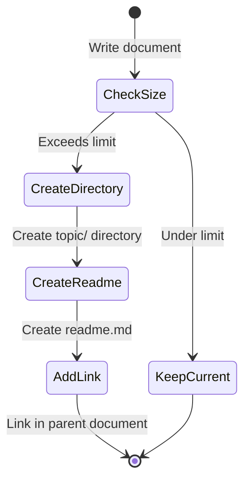

# Writing Documents

## Overview
aidlc helps AI assistants and developers maintain consistent, scalable documentation.

**Problem:** Documentation grows chaotic - files become too long, structure unclear, hard to navigate.

**Solution:** Enforce size limits (30 + 5n lines), automatic splitting rules, and hierarchical organisation that keeps parent docs scannable while preserving detail in sub-documents.

## Basic Principles
- Write structured documents (start with readme.md)
- Prioritise clarity, pursue conciseness
- Utilise Mermaid diagrams
- Specify purpose and outcomes
  - Problem solving: Problem definition + value gained from resolution
  - Feature implementation: Requirements + expected effects
  - Research/analysis: Questions + decision-making criteria
## Document Separation Criteria
- All documents: 30 lines (basic description) + (number of sub-documents × 5 lines)
  - Count non-blank lines only, excluding code blocks and diagrams
  - Example: 3 sub-docs → 30 + 3×5 = 45 lines max
- Separate into sub-documents when exceeding this criterion
- Separate independent topics immediately
## File Structure
- All documents with sub-documents: `{topic}/readme.md`
- All sub-documents: `{topic}/sub-topic/readme.md`
- Benefit: No migration needed when sub-documents grow and split further
## Writing Process
When a document exceeds size criteria, follow this workflow to split and reorganise:

## Diagram Usage
Use scripts/draw.sh to convert md to png
- Process: flowchart/graph
- Structure: classDiagram
- Sequence: sequenceDiagram

## Goals
- **Fast review:** Stakeholders scan parent docs without diving deep
- **Detailed work:** Developers access complete specs in sub-documents
- **Iterative refinement:** Validate consistency by summarising sub-docs and comparing against parents
